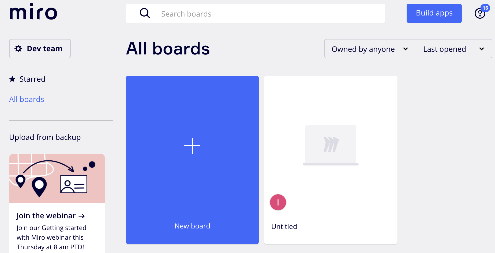
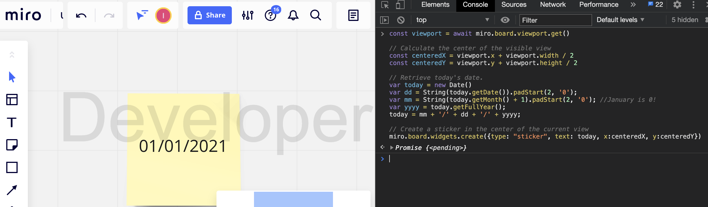
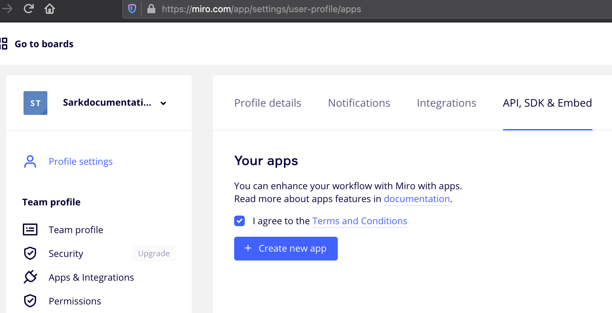
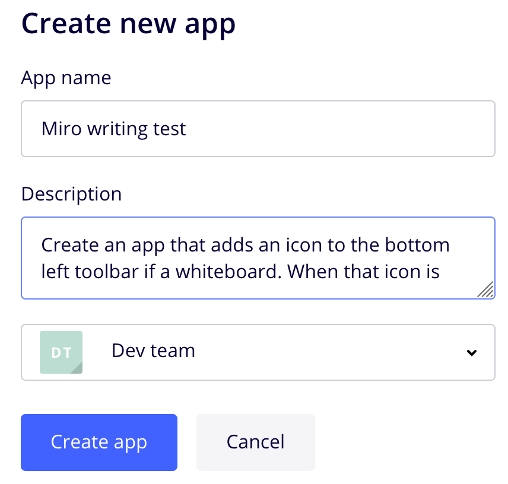
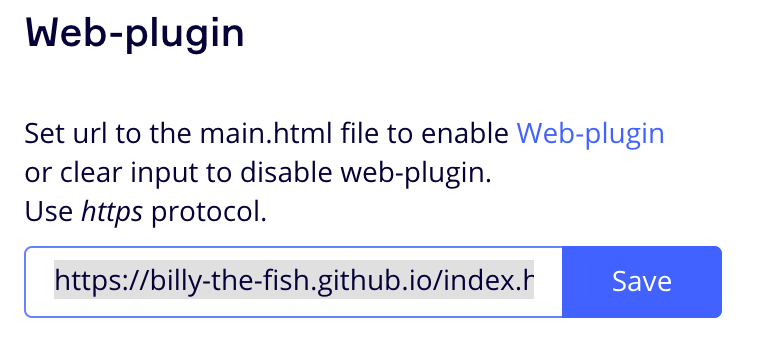
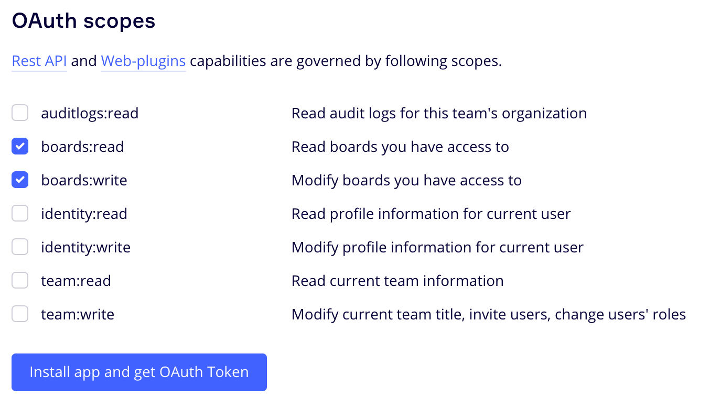
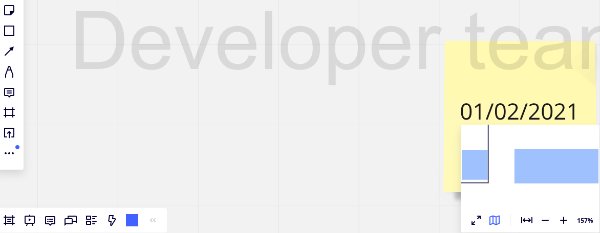

:WSDK: Web SDK
:WPI: Web-plugin
:DT: Developer Team
:MDA: Miro developer team
:MAPP: Miro App
:BOARD: whiteboard

= Get started with Miro {WPI}s

Miro is a fast, free, infinite, and digital {BOARD} that you use to ideate, strategize, organize, and collaborate with your distributed team in the cloud at any time.

You use {WSDK} to create custom features in your Miro whiteboards that suit the way of working for your team. For example, you can create custom:

* Visual asset management features and ensure that your whiteboards include branded icons and images

* Syncronizations between Miro items with other tools using custom fields and interfaces

* Collaboration plugins for remote meetings, workshops and retrospectives

https://developers.miro.com/docs/web-plugins-features[{WPI} features] suggests the benefits you can add to your custom whiteboards.

This section shows you how to rapidly create a custom {WPI} for the whiteboards that could benefit your team.

:toc:

== Prerequisites

In order to create a custom Miro {BOARD}, you must already:

* Use a browser with a developer console such as:

** Google Chrome
** FireFox

* Have a basic understanding of JavaScript and Web applications.

* https://docs.github.com/en/free-pro-team@latest/github/working-with-github-pages/creating-a-github-pages-site[A GitHub pages repository] to serve your {WPI}. For example: https://billy-the-fish.github.io/.
+
If you wish to test from your local machine and not a public server, install https://github.com/http-party/http-server[http-server] to publish your page and create an https://ngrok.com/[ngrok] account to tunnel your content to a public URL.

== Create a custom date sticker

In order to create a custom {WPI} for a Miro {BOARD} that shows the current date at the touch of a button:

. *Create a {MDA}*:
+
In your browser, navigate to https://miro.com/signup/ and follow the setup wizard.

. *Create and test  your {WPI} code*:
+
You use the Developer Console in your browser to test your {WPI}. To do this:

.. Write your {WPI} code:
+
This code calculates the center point of the current https://developers.miro.com/docs/board-manipulation[miro.board.viewport] instance, and writes today's date to a https://developers.miro.com/docs/interface-istickerwidget[sticker].
+
[source,javascript]
----
// Retrieve the whiteboard currently visible in the browser.
const viewport = miro.board.viewport.get()

// Calculate the center of the visible view
const centeredX = viewport.x + viewport.width / 2
const centeredY = viewport.y + viewport.height / 2

// Retrieve today's date.
var today = new Date()
var dd = String(today.getDate()).padStart(2, '0');
var mm = String(today.getMonth() + 1).padStart(2, '0'); //January is 0!
var yyyy = today.getFullYear();
today = mm + '/' + dd + '/' + yyyy;

// Create a sticker in the center of the current view
miro.board.widgets.create({type: "sticker", text: today, x:centeredX, y:centeredY})
----

.. Open a {BOARD} from your https://miro.com/app/dashboard/[{MDA}]:
+

.. Test your {WPI} code:
+
Open the developer console for your {BOARD}, paste your code into it and press Enter.
+

+
You see your custom sticker.

. *Publish your {WPI} to the Internet*:
+
Miro retrieves your {WPI} code from an HTML page that is securely accessible from the Internet. For example, https://billy-the-fish.github.io/index.html.  To do this:

.. Push the _index.html_ page that holds your code to root directory of your publicly available GitHub repository. For example:
+
[source, html]
----
<!DOCTYPE html>
<html lang="en">
<head>
    
    
</head>
</html>
----
+
If you are using http-server and ngrok, start the processes in the directory holding _index.html_ and note the HTTPS URL delivered by ngrok. For example, https://b26dd530f70b.ngrok.io.

. *Create a {MAPP}*:
+
A {MAPP} is the collection of code, resources and rights you need to securely publish a {WPI} or enable REST calls to the {BOARD}s available to your audience. A {MAPP} also authenticates the URL you publish your App to.
+
To create an {MAPP}:

.. In your browser, navigate to https://miro.com/app/settings/user-profile/apps.

.. Agree to the _Terms and Conditions_ and click _Create new app_.
+

.. In _Create App_, fill in the app information and click _Create app_.
+

.. Set _Web-plugin_ to the public URL for your {WPI}.
+

+
If you are using ngrok, this is the URL you noted earlier.

.. Choose the _OAuth scopes_ for your {WPI} and click _Install app and get OAUTH Token_.
+
In Miro, OAuth https://developers.miro.com/docs/sdk#scopes[scopes] govern the permissions and capabilities of your {WPI}. When you enable a scope, each user has the associated permissions. For this {WPI}, members of your {MDA} need to read and write to a {BOARD}.
+

+
Your {WPI} is now added to all the whiteboards in your {MDA}.

. *View your {WPI}*:
+
Refresh one of the boards in your {MDA}. Click the button that your {WPI} adds to the bottom bar and see your custom widget appear in the {BOARD}.
+

== Reference

The Miro objects you used in this section are:

|===
|Object | Description

| https://developers.miro.com/docs/board-manipulation[miro.board.viewport]
| The Miro {BOARD} currently visible in your browser.

|https://developers.miro.com/docs/interface-istickerwidget[sticker]
| A specialized https://developers.miro.com/docs/interface-iwidget[iWidget] that creates a yellow square on a {BOARD}.

|===

